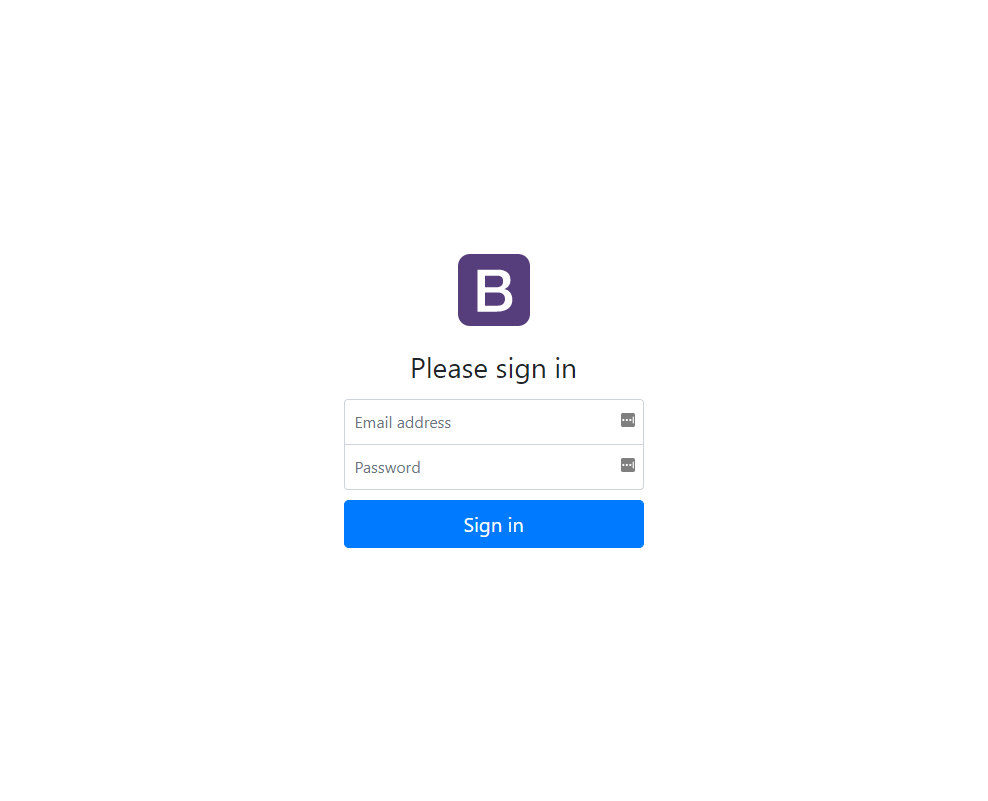

## Laravel and Vue JS authentication using JSON Web Tokens

This source code demonstrates how to use JWTs with Laravel and Vue JS.

Laravel version 5.5

[Blog post - Part 1](http://blog.peterplucinski.com/setting-up-jwt-authentication-with-laravel-and-vue-part-1/)

[Blog post - Part 2](http://blog.peterplucinski.com/setting-up-jwt-authentication-with-laravel-and-vue-part-2/)

## Requirements

- [Laravel server requirements](https://laravel.com/docs/5.5#server-requirements)
- Laravel 5.5 requires PHP 7.0 or later

## Setting up the project

1. Clone the repository
1. Run `composer install`
1. Configure Laravel directory permissions ([documentation](https://laravel.com/docs/5.5))
1. Create a database and setup the database configuration inside `.env`
1. Run `php artisan key:generate`
1. Run `php artisan migrate`
1. Run `php artisan jwt:secret`
1. Run `npm install`
1. Use `php artisan tinker` to create a test user:

```
App\User::create(['name' => 'Test User', 'email' => 'test@email.com', 'password' => Hash::make('Password01')])
```

## Build
- Once you have made changes to the JavaScript or SCSS files you will want to run `npm run dev` or `npm run production`



